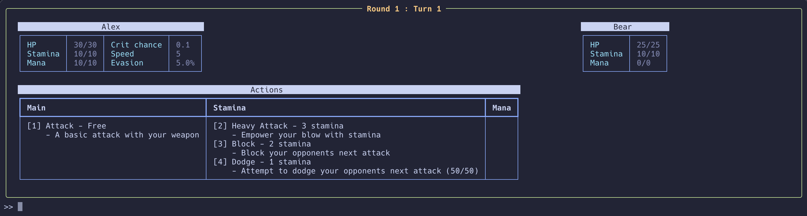

# Fantasy Rush

A small, fully self programmed, turn-based CLI combat game, where you have to survive 20 rounds in an arena, including boss fights, to win and save your favourite pet.

This project was created as part of my [Boot.dev](http://boot.dev/) journey, you can find the rest of my Boot.dev projects [here](https://github.com/alexreynlds/bootdotdev-projects)



## Requirements

- [uv](https://docs.astral.sh/uv/) (Python package manager)

## Running it

```bash
git clone git@github.com:alexreynlds/fantasy-rush.git
cd fantasy-rush
uv sync
uv run python main.py
```

## How to play

- Each round you will come across a randomly selected enemy
- You have multiple different actions you can take, with the aim of defeating the enemy
- Enemies will drop gold and you can spend said gold in the shop which is every 5 turns
- At round 10 and 20 you will fight a boss enemy
- Goodluck!

## Side note

Real quick, I'm not any good at game balancing, nor did I want to spend too long on this project as I wanted to continue the course, therefore the game is lacking in balance and features.
However, I'm still proud with its current state and I may come back to it in the future to continue development!
Hope you enjoy :)
